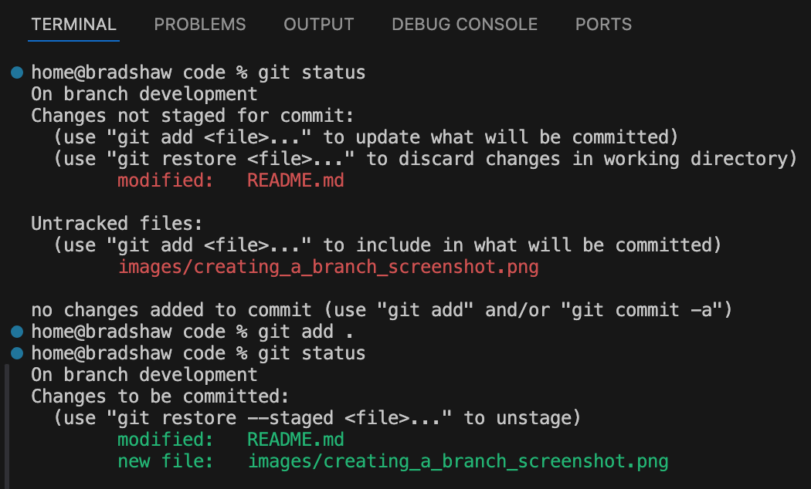
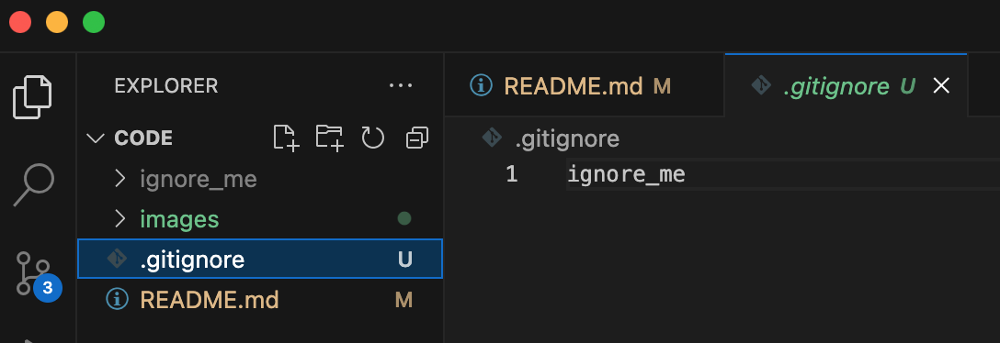

# CFGDegree-assignments

A GitHub repository to store my CFG Degree assignments.

In this readme you will find the descriptions and screenshots I have created for Assignment 1.

For the past 5 years I have been on a career break to look after my children. This has always been my ambition to create a long lasting relationship with them whilst they are young. My son loves :tractor: and my daughter loves :fairy:.


During that time I have had the opportunity to learn how to switch careers and what I am best suited at. I have spent the past 15 months in the evenings learning :student: how to code including:

- HTML
- CSS
- JavaScript
- MySQL
- React

I have learnt the basics of other languages but I always come back to JavaScript. I have used CFG MOOCs and KickStarters alongside Udemy to learn. My husband is very supportive of my learning journey and this CFG Degree.

I previously created a GitHub Profile readme which can be found **[here](https://github.com/jacquelyn-bradshaw)**.

Previous repositories I have created can be found **[here](https://github.com/jacquelyn-bradshaw?tab=repositories)**.

## Assignment 1 Tasks

- [x] Create a private repository
- [x] Create a README.md
- [x] Use at least 6 different markdown text formatting features
- [x] Demonstrate checking the status
- [x] Demonstrate creating a branch
- [x] Demonstrate adding files to a branch
- [x] Demonstrate adding commits with meaningful messages
- [x] Demonstrate opening a pull request
- [x] Demonstrate merging and deploying to main branch
- [x] Create .gitignore
- [x] Create requirements.txt

### Checking the status

To check the status you run the command `git status`

Here is a screenshot of this command in use:


### Creating a branch

To create a branch named development you run the command `git branch development`

Here is a screenshot showing use of the commands for creating a branch, listing your branches and switching branch:


### Adding files to a branch

I have switiched to my development branch and added files to my local repository in Visual Studio Code. To stage the files you use the command `git add .` to add all changes.



If I had wanted to just add the image to my local resposity on it's own I would use the command `git add images/creating_a_branch_screenshot.png`

### Adding commits with meaningful messages

Here are some screenshots of some of the commits I have made:


### Opening a pull request

Here are some screenshots of me opening a pull request:


## Merging and deploying to main branch

Here are some screenshots of me merging to the main branch:


### .gitignore

.gitignore is a file that can be added to the root directory of your repository. It stops files or folders you have added to the .gitignore file from being committed to your repository. I have created a ignore_me folder and added it to my .gitignore file so that it is not committed. I have previously used .gitignore files to ensure that node modules are not committed.



### requirements.txt

A file that contains all the libraries or packages your code depends on. You create a list of packages or libraries. You can use == and then specify a version for that package or library **e.g. package/library_name == version**. To install the packages or libraries in the requirements.txt file you use the command:

```
pip install -r requirements.txt
```
