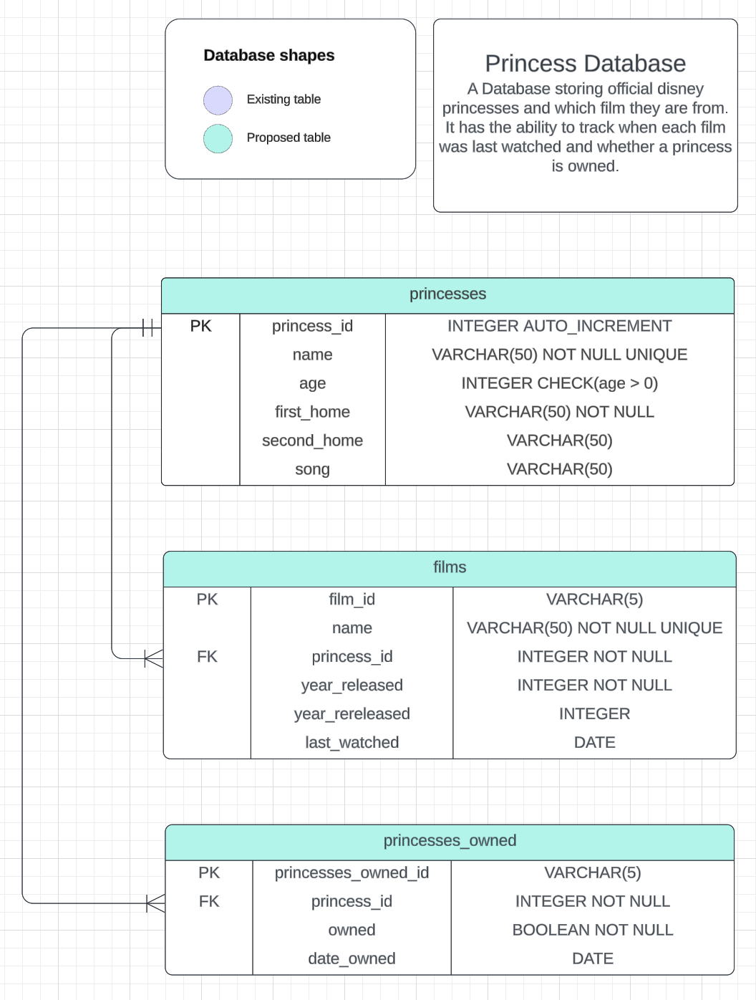

# Assignment 3 SQL

**Princess Database**

A Database storing official disney princesses and which film they are from. It has the ability to track when each film was last watched and whether a princess is owned.

## Scenario

I want to help my daughter know the disney princesses and films by creating a princesses database. To do this I have stored princesses (princess_id, name, age, first_home, second_home, song), films (film_id, name, princess_id, year_released, year_rereleased, last_watched) and princesses owned (princesses_owned_id, princess_id, owned, date_owned) so that the princesses and films tables can be viewed. I have used three insert queries to enter data into the three tables. I have wrote queries to find princesses with a particular age, find princesses that have a second home, find princesses whose name starts with a chosen letter, find films watched in a particular period and find films that were released or rereleased during or after a chosen year. All these queries use order by to organise the results. I have created a delete query to delete a row from the princesses owned table. I have used aggregate functions to show statistics on the average age of the princesses, the longest time since a film was watched, number of princesses by their age and the number of princesses owned.

Tables use ID as their primary key and princess IDs link princesses to films and princesses to princesses owned. I have used AUTO_INCREMENT for the princess_id. I have used varchar with different limits for the number of characters for my text data. I have used integer for numbers. I have used date for when films were last watched or when princesses became owned. I have used a boolean for whether princesses are owned. I have used NOT NULL where appropriate, CHECK to make sure an age is positive and UNIQUE to ensure some coloumns hold unique values.

I have used joins to show all films data and their associated princesses data, to show princess names for princesses that are owned and to find a favourite princess or a favourite film. I have used the string inbuilt functions to create a princess description and the date inbuilt functions to format my dates in an easier to read format and to find films that were last watched over a year ago.

I have created a stored procedure to change the date that a film stored in the films table was last watched and this stored procedure can be used by calling change_date_last_watched with a stored film name followed by the latest date it was watched.

I would like to create a website/app for this database so my daughter could easily display the information stored and query the tables e.g. find films watched in a particular period, find films released after a certain date or find the names of the princesses that are owned or not owned. Also she would be able to update when a film was last watched.

## ER diagram

Diagram showing the design of my tables and table relations in the princesses database



## Create the database

To create the database, run the create_database sql file.

```
mysql < create_database.sql
```

## Create the tables

To create the tables, run the create_tables sql file.

```
mysql < create_tables.sql
```

## Insert the data

To insert the data, run the insert_data sql file.

```
mysql < insert_data.sql
```

The princess and film data is real disney data. The date_watched column in the films table and the owned and date_owned columns in the princesses_owned table are personal data for the user.

## Delete data

Run the delete_data sql file to delete the data for `princesses_owned_id = "PO1"`.

```
mysql < delete_data.sql
```

## Retrieve data

To run my queries to retrive data, run the retrieve_data sql file.

```
mysql < retrieve_data.sql
```

## Aggregate functions

Run the aggregate_functions sql file for queries using MIN, AVG and COUNT aggregate functions.

```
mysql < aggregate_functions.sql
```

## Joins

To run my queries that involve joins, run the joins sql file.

```
mysql < joins.sql
```

## In-built functions

To run my queries that involve in-built functions, run the inbuilt_functions sql file.

```
mysql < inbuilt_functions.sql
```

## Stored Procedure

To create and use my stored procedure, run the stored_procedure sql file.

```
mysql < stored_procedure.sql
```
