# Assignment 4 - APIs

Scoreboard API. This API should allow users of my Train the Tractors app to create a user, view users, add a score to the scoreboard, view the scoreboard and delete a score from the scoreboard. Each users name is stored in the users table in the database along with an automatically generated user_id. Each score should include the name of the user (which is turned into the user_id in the code) and a score. These are saved in the scores tables in the database along with an automatically generated score_id.

In future I would like to join my front-end Train the Tractors app created in assignment 2 to this API so that scores are automatically added to the scoreboard when a user completes the game. I would like to have a user interface for the scoreboard and a button for users to delete their scores. Admin could have access to a user interface for the users table and the option to delete users.

## Setting up the database

In the database_creation folder you will find two files to set up the database and tables. This needs to be completed before you run the API.

To create the database, run the create_database sql file.

To create the tables, run the create_tables sql file.

## .env file

I have included my .env file in this assignment so it can be marked but otherwise it would be in the .gitignore file and an example of how the .env file should look could be included instead along with instructions in the README for the user to create a .env file

Open the `.env` file

You will need to ensure that for `MYSQL_PASSWORD = password`, `password` matches your personal MySQL password.

## Install dependencies

To install dependencies, run the following command in the terminal:

```
npm install
```

## Start the server

To start the server, run the following command in the terminal:

```
npm start
```

## My endpoints

### GET /

This endpoint sends the user to my index.html page where they can enter their name into a form.


### GET /users

This endpoint returns json data showing the results of my query to find all users.

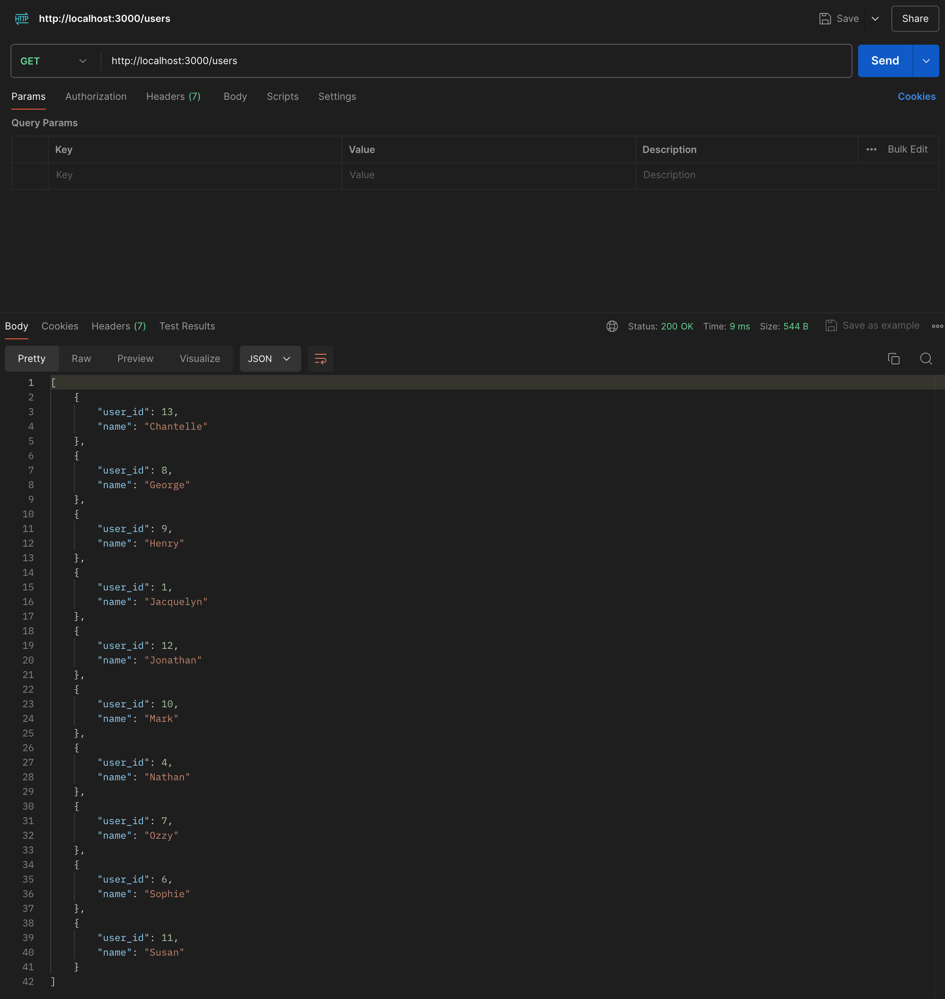

### GET /scoreboard

This endpoint returns json data showing the results of my query (using an inner join to replace score_id with name) to find all scores.

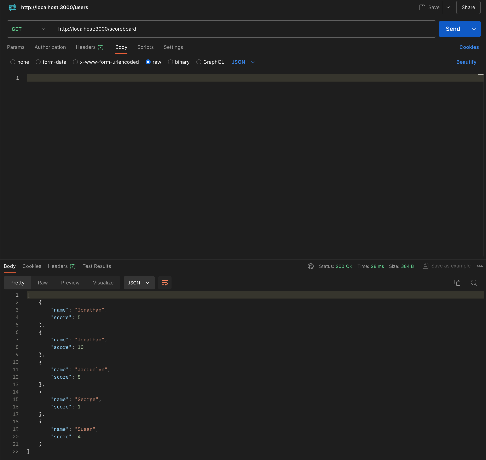

### POST /users

This endpoint sends data using a form on my GET / endpoint to add a user to my users table.
Alternatively a user can be added using Postman or equivalent by sending json data e.g.

```
{
 "name": "Adam"
}
```

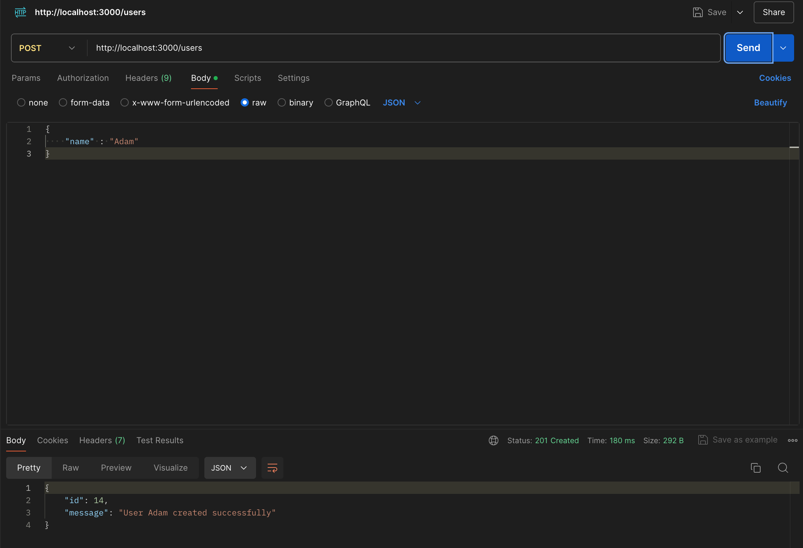

If a user does not supply a name, a status 400 code is shown along with an error message.

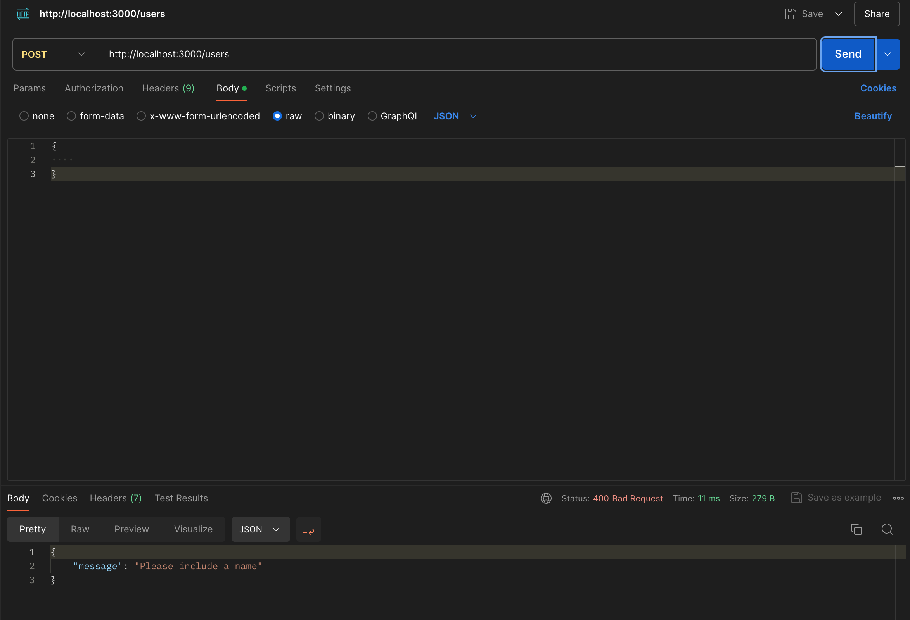

If a user already exists, a status 400 code is shown along with an error message.

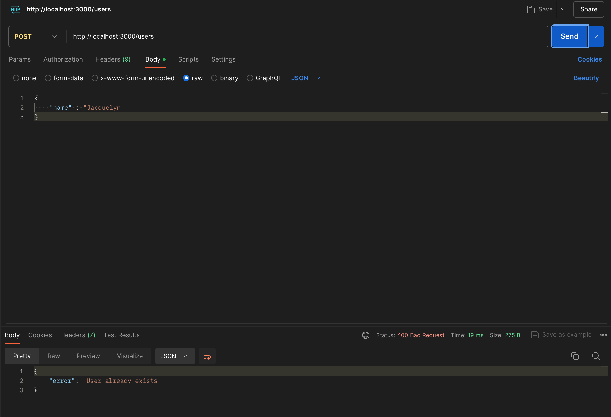

### POST /scoreboard

This endpoint sends json data using Postman or equivalent to add a score to the scores table. A name and a score needs to be used e.g.

```
{
  "name": "Jacquelyn",
  "score": 8
}
```

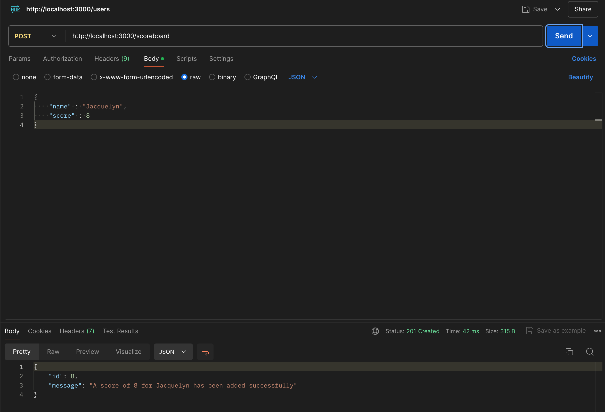

If a user does not supply a name or a score, a status 400 code is shown along with an error message.

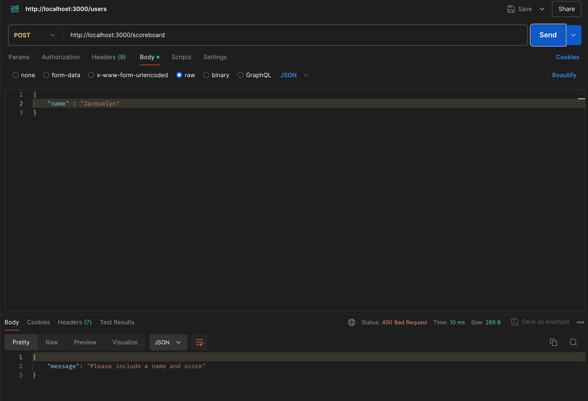

If the name supplied does not match a user in the users table, a status 404 code is shown along with an error message.


If a user does not supply a number for the score, a status 400 code is shown along with an error message.

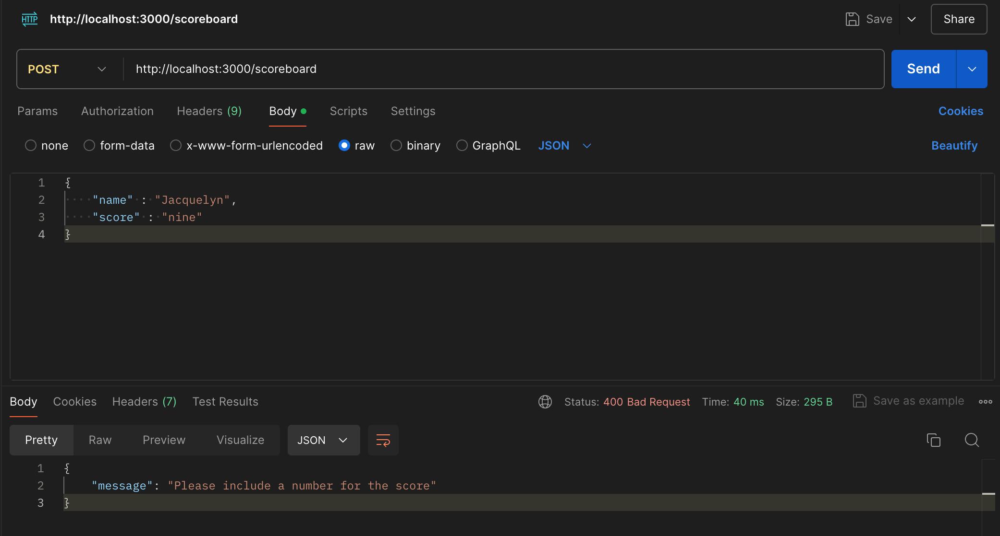

### DELETE /scoreboard/:id

This endpoint uses Postman or equivalent to delete a score from the scores table. A score_id is needed in the path.

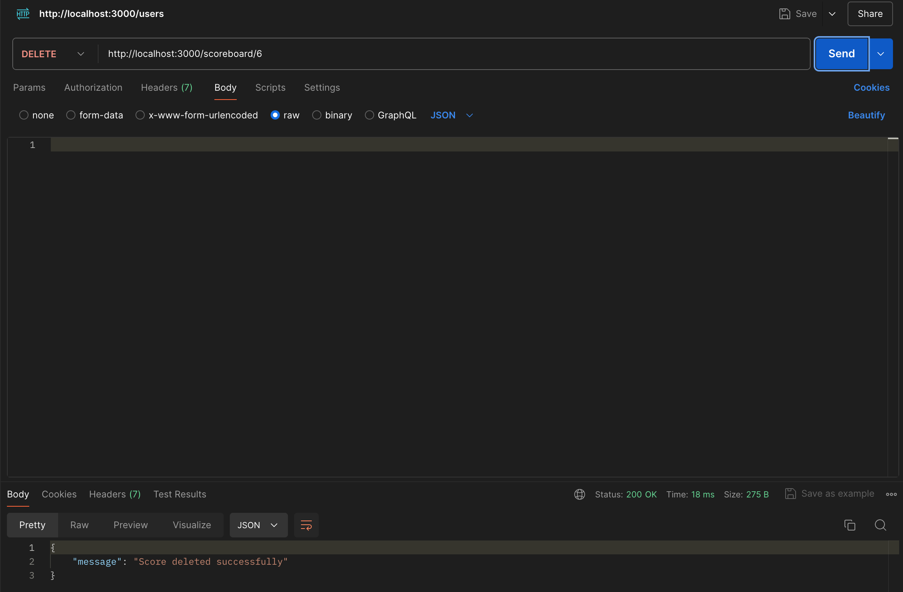

If a user does not supply a number for the score_id, a status 400 code is shown along with an error message.

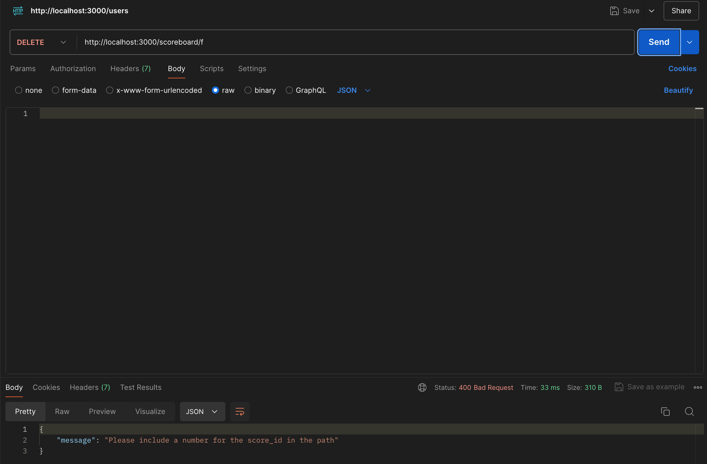

If a user supplies a number for the score_id that does not match a score_id in the scores table, a status 404 code is shown along with an error message.

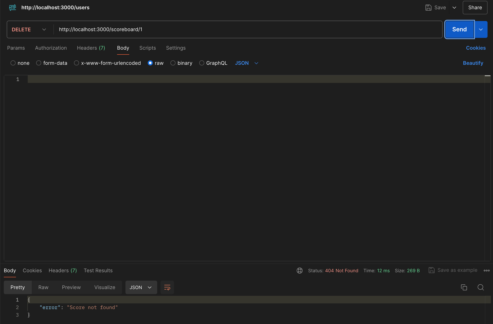
